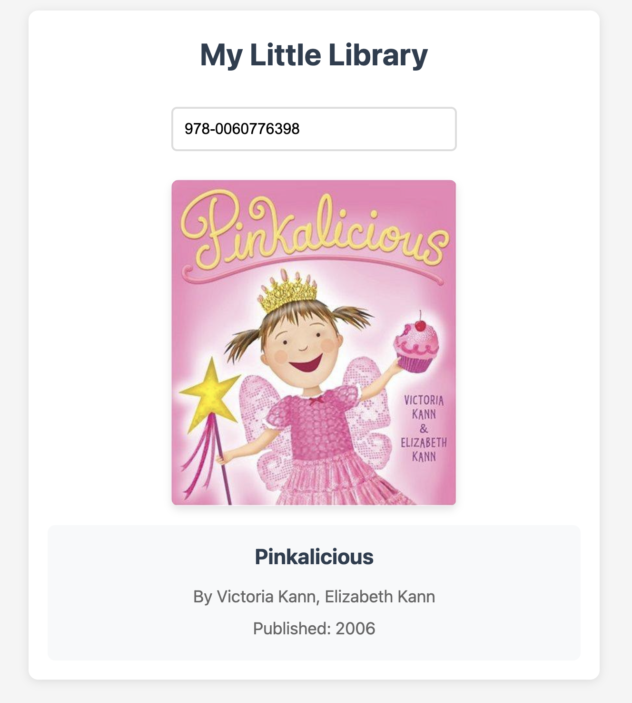

# My Little Library

> _Note: Everything in this repo was initially generated with AI assistance before being thoughtfully attacked and refined by a quirky human. Including this README._

A fun, interactive web application that lets kids play librarian by scanning book barcodes to display book covers and information. This simple, single-page application (SPA) works with real barcode scanners and instantly retrieves book details when an ISBN is scanned.

  

## 🎯 Features

- **ISBN Scanning**: Supports both ISBN-10 and ISBN-13 formats with any USB barcode scanner that functions as a keyboard device
- **Real-time Book Information**: Displays book covers, titles, authors, and publication dates
- **Child-Friendly Interface**: Simple, colorful design that kids can use independently
- **No Installation Required**: Runs in any modern web browser
- **Offline Capable**: Can be saved as a local file and used without an internet connection (though book data requires internet)

## 🚀 Quick Start

1. Connect a barcode scanner to your computer (any USB scanner that acts as a keyboard input device)
2. Open `index.html` in any modern web browser
3. Scan a book's ISBN barcode or type it manually
4. Watch as the book cover and details appear automatically!

## 📚 How It Works

The application leverages the [Open Library API](https://openlibrary.org/dev/docs/api/books) to retrieve book information:

1. When an ISBN is scanned or entered, the app validates it's a proper 10 or 13-digit ISBN
2. It then makes an API request to Open Library for the book metadata
3. Simultaneously, it fetches the book cover image from Open Library's covers API
4. All information is displayed in an easy-to-read format

## 🧩 Technical Details

- Built with vanilla JavaScript, HTML, and CSS - no frameworks or dependencies
- Uses the Fetch API for making asynchronous requests
- Responsive design that works on desktops, tablets, and mobile devices
- Implements debounce function for optimizing barcode scanner input

## 🧒 Kid-Friendly Use Cases

- **Home Library Organization**: Kids can catalog and organize their home libraries
- **Pretend Play**: Turn reading time into pretend library/bookstore play
- **Book Discovery**: Learn more about books they already have or find at the library
- **Reading Motivation**: Makes selecting books more interactive and engaging

## 🔊 Scanner Configuration Resources

Finding the right scanner settings can enhance the experience for kids. The beep volume needs to be fun yet not disruptive (depending on your tolerance for pain), and scan speed should match children's skill levels. Here are helpful resources I used for configuring your barcode scanner:

- [Honeywell 3800 Scanner User's Guide](https://www.granitemedia.org/wp-content/uploads/2011/08/Honeywell-3800-Scanner-Users-Guide.pdf) - Complete guide with volume control settings (pages 12-13) and scanning speed adjustments (pages 8-11).

- [Honeywell 3800 Quick Reference](https://cdn.barcodesinc.com/resources/HHP3800.pdf) - Handy quick reference for common scanner configurations.

**Tips for Kid-Friendly Scanning:**

1. Medium volume works well for most home environments
2. Consider adjusting scan speed based on age (younger children may benefit from slower scanning rates)
3. Keep a printed copy of the scanner reset barcode for easy troubleshooting

Finding the right balance of scanner settings makes the experience more enjoyable for kids while keeping the peace at home or in the classroom.

## 📝 License

This project is open source and available under the [MIT License](LICENSE.txt).

## 🤝 Contributing

Contributions, ideas, and feedback are welcome! Feel free to open an issue or submit a pull request.
